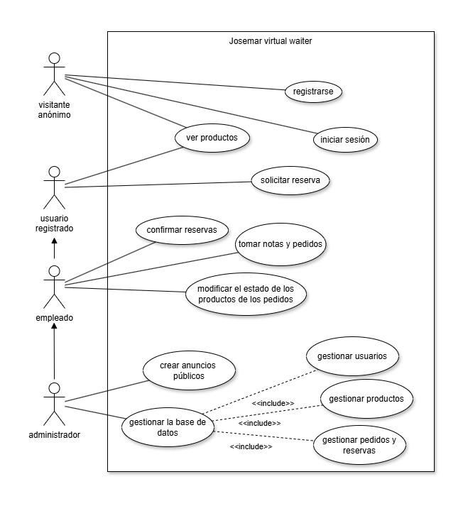
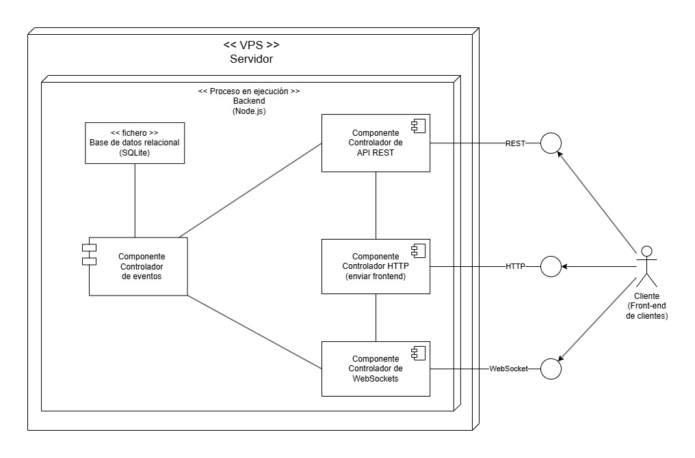

# Sobre este repositorio

Proyecto de fin de grado, un prototipo de aplicación pensada para ayudar a **un caso específico** mediante la toma de notas, de reservas y mostrar el menú en vivo.

Emplea tecnologías como Websockets, peticiones REST y varios. Abajo del todo se adjuntan planos y alguna que otra imagen para hacerse una pequeña idea.

Se puede observar las diferentes modificaciones y el progreso viendo el historial de versiones.
Este proyecto es solo un prototipo por lo que carece de filtrado de datos, es bastante inseguro y se han usado tecnologías incompatibles debido a que no está enfocado en la escalabilidad y la interfaz está preparada específicamente en los dispositivos móviles.
También parece un "frankestein" porque me gusta entender a fondo lo que uso e integrarlo al máximo a mi manera.

## Conocimientos adquiridos

En este proyecto se ha podido aprender más acerca de varios focos:

- Gestión de proyectos complejos
- Respetar los tiempos de entrega
- Aplicar conocimientos y aprender a usar nuevas herramientas (Svelte, WebSockets, SQLite, etcétera...)
- Lanzar aplicaciones en producción
- Gestionar un servidor web

## Despliegue y ejecución

Yo he usado `yarn` pero se puede usar npm.

```sh
#instalar módulos
npm run installAll

# añadir un .env y montarlo
cp serverData .env.template .env
# para solo pruebas: echo SESION_SIGN_COOKIE_KEY="test" > serverData/.env

# ejecutar en desarrollo
npm run dev
# si a cambio quieres compilar y desplegar
npm run build
npm run start

# info adicional
# - npm run install realiza lo siguiente:
# # npm install
# # cd backend
# # npm install
# # npm run installModules
# # cd ../frontend
# # npm install
# # cd ..
```

## Comandos globales

- `npm run dev`: Despliegue en testeo
- `npm run build`: para compilar el proyecto
- `npm run start`: para desplegar en producción
- `npm run stop`: para parar el despliegue en producción

## Documentos y planos

En esta sección se pueden observar algunas de las planificaciones realizadas en las que se ha basado la aplicación

### Diagrama de casos de uso

Algunas de las acciones que se pueden realizar en la aplicación y que usuarios pueden realizarlas.



### Diagrama de despliegue

Muestra la arquitectura de la aplicación sin entrar muy al detalle pero mostrando la funcionalidad global.

